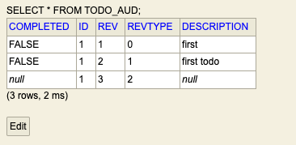

# Audit the hack out of your data with just two annotations

## Introduction
In this article, we will see how to audit changes to your data saved in a relational datastore (like Mysql, H2, etc) with JPA and @Auditable annotation. In this approach, we will have separate audit tables for each table we want to keep track of. The audit tables will have the same schema as the table we want to audit, with additional columns to track the changes. 

The audit tables will have the same name as those we want to audit with the suffix `_audit`. For example, if we want to audit the table `user`, then the audit table will be `user_audit`. The scope of the article is limited to auditing the modified data using JPA's; all manual updates to the database will not be tracked.

## Why audit data to begin with?

Here are some reasons why organizations may choose to audit their data:
1. To ensure data accuracy - Auditing can help identify errors and inconsistencies in data, which can then get corrected. This is important for ensuring the data is reliable and can get used for decision-making.
2. To identify potential fraud or misuse of data - Auditing can help identify patterns of activity that may indicate fraud or abuse of data. This can help to prevent financial losses and protect the integrity of the data.
3. To comply with regulations - In some cases, organizations must audit their data to comply with regulations. For example, financial institutions must audit their data to comply with the Sarbanes-Oxley Act.
4. To improve data management efficiency - Auditing can help identify areas where data management can improve. This can lead to more efficient use of resources and enhanced decision-making.
5. To improve the quality of data reporting - Auditing can help to ensure that data reports are accurate and complete. This can improve the quality of decision-making based on the data.

## Setup auditting

In this approach, we will use Spring data envers to audit the data. Spring data envers is a library that provides auditing capabilities for JPA-based repositories. It stores the audit information in a separate table that can reside in the same database. The library also offers APIs to query data from these audit tables. We will go over them in detail in the later sections.

The complete source code is available in the [github repository](https://github.com/hariohmprasath/spring-audit-tables.git)

### Step 1: Add dependency

Add the following dependency to your `pom.xml` file to pull in spring data envers library.

```xml
<dependency>
    <groupId>org.springframework.data</groupId>
    <artifactId>spring-data-envers</artifactId>
</dependency>
```

### Step 2: Create JPA Entity and enable auditing
Lets create a simple entity `Todo` that has `id`, `description` and `completed` fields to represent a todo item. Add `@Audited` annotation to the entity class to enable auditing on this entity class.

Here is how it looks like:

```java
@Entity
@Audited // Enable auditing for this entity
@Data
public class Todo {
    @Id
    @GeneratedValue
    private int id;
    private String description;
    private boolean completed;

    public Todo() {
    }

    public Todo(String description) {
        this.description = description;
    }
}
```

### Step 3: Enable auditing API's on JPA repository
Let's create a JPA repository (`TodoRepository`) for the `Todo` entity that will extend `RevisionRepository` interface provided by spring data envers along with the usual `JpaRepository` interface. 

> `RevisionRepository` provides APIs to query the audit data stored in the audit tables. 

Here is how the JPA repository looks like:

```java
import org.springframework.data.jpa.repository.JpaRepository;
import org.springframework.data.repository.history.RevisionRepository;


public interface TodoRepository extends RevisionRepository<Todo, Integer, Integer>
        , JpaRepository<Todo, Integer> {
}
```

`RevisionRepository` offers the following APIs to query data stored in the individual audit tables:
* `Optional<Revision<N, T>> findLastChangeRevision(ID id)` - Returns the latest revision of the entity with the given id.
* `Revisions<N, T> findRevisions(ID id)` - Returns all revisions of the entity for the given id.
* `Page<Revision<N, T>> findRevisions(ID id, Pageable pageable)` - Returns a page of revisions for the entity with the given id.
* `Optional<Revision<N, T>> findRevision(ID id, N revisionNumber)` - Returns the revision of an entity with the given id and revision number.

### Step 4: Setup main class for auditing
We need to add `@EnableJpaRepositories(repositoryFactoryBeanClass = EnversRevisionRepositoryFactoryBean.class)` with a `repositoryFactoryBeanClass` attribute to enable JPA repositories with auditing. Adding this annotation will automatically save the modified information to the audit tables whenever an entity is created, updated or deleted. 

Here is how the main application class looks like:

```java
@SpringBootApplication
@EnableJpaRepositories(repositoryFactoryBeanClass = EnversRevisionRepositoryFactoryBean.class)
public class AuditTablesApplication {
   public static void main(String[] args) {
        SpringApplication.run(AuditTablesApplication.class, args);
    }
}
```

## Build sample application
1. To validate everything, we will create a simple Rest controller in the main application class that enables CRUD operations on the `Todo` entity. On a high level the newlys added REST API's will look like below:

* `POST /todo/{description}` - Create a new todo item with the given description
* `GET /todo/{id}` - Get the todo item with the given id
* `PUT /todo/{id}/{description}` - Update the description of the todo item with the given id
* `DELETE /todo/{id}` - Delete the todo item with the given id

Here is a updated version of the main application class with the `@RestController` that demonstrates creation of a new todo item using `POST` method:

```java
@SpringBootApplication
@RestController
@EnableJpaRepositories(repositoryFactoryBeanClass = EnversRevisionRepositoryFactoryBean.class)
public class AuditTablesApplication {
    @Autowired
    private TodoRepository repository;

    @PostMapping("/todo/{description}")
    public Todo createTodo(@PathVariable String description) {
        return repository.save(new Todo(description));
    }
}
```

2. As we are using the inbuilt h2 database, lets enable the `H2` web console to view the data so we can validate the data getting saved in these audit tables. Add the following properties to the `application.properties` file:

```properties
spring.h2.console.enabled=true
```

## Test the application

Start the Spring boot application and run the following curl command to create a new todo item, update it and finally delete it from database:

```bash
curl -X POST http://localhost:8080/todo/first
curl -X PUT http://localhost:8080/todo/1/first%20todo
curl -X DELETE http://localhost:8080/todo/1
```

## Query audit data

Lets query the audited data using H2 web console and the APIs provided by spring data envers.

### 1. Query using H2 web console
1. Open the `H2` web console (`http://localhost:8080/h2-console`) and connect to the database. You should see the following tables created in the database:

* `TODO` - Table to store the todo items
* `TODO` - Table to store the audit information for the todo items

2. Run the following query to see the data in the `TODO` table:

```sql
SELECT * FROM TODO;
```

> The resultset will be empty as we have deleted the todo item that we created in the previous step.

3. Run the following query to see the data in the `TODO_audit` table:

```sql
SELECT * FROM TODO_AUD;
```

Here is the result:


Here are some key points on the columns in the `TODO_AUD` table:
* `ID` - Points to the id of the todo item in the `TODO` table
* `REV` - Revision number of the audit record
* `REVTYPE` - Type of the revision, can be `0` for `ADD`, `1` for `MODIFY` and `2` for `DELETE`

### Query audit data using APIs
We can also use the APIs provided by spring data envers to query the audit data. For example if you want to get the latest revision of a todo item with the given id, you can use the `findLastChangeRevision` API provided by the `RevisionRepository` interface. 

Here is how the main application class woud look like:

```java
@SpringBootApplication
@RestController
@EnableJpaRepositories(repositoryFactoryBeanClass = EnversRevisionRepositoryFactoryBean.class)
public class AuditTablesApplication {
    @Autowired
    private TodoRepository repository;

    @PostMapping("/todo/{id}")
    public Todo getTodo(@PathVariable int id) {
        return repository.findLastChangeRevision(id).get().getEntity();
    }
}
```

## Conclusion

In this article, we saw how to audit the data stored in a relational database using spring data envers. We saw how to enable auditing for a JPA entity and how to query the audit data using the APIs provided by spring data envers. We also saw how to view the audit data stored in the audit tables using the `H2` web console.
